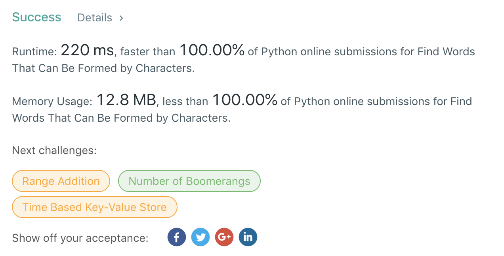

```python
class Solution(object):
    def countCharacters(self, words, chars):
        """
        :type words: List[str]
        :type chars: str
        :rtype: int
        """
        cdict = {}
        for c in chars:
            if c not in cdict:
                cdict[c] = 0
            cdict[c] += 1
        gcnt = 0
        for w in words:
            wdict = {}
            for c in w:
                if c not in wdict:
                    wdict[c] = 0
                wdict[c] += 1
            is_good = True
            for c, cnt in wdict.items():
                if c not in cdict or cnt > cdict[c]:
                    is_good = False
                    break
            if is_good:
                gcnt += len(w)
        return gcnt
```

