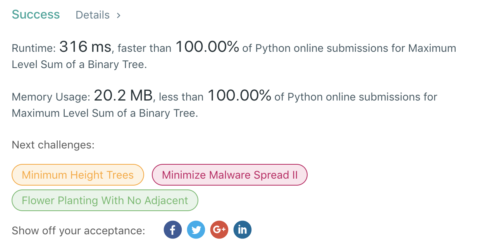

## Question in Human Language

In a binary tree, which level has the maximum sum (for ties, the shallow level wins)?

For **INHUMAN** description, please check it out on [LeetCode](https://leetcode.com/problems/maximum-level-sum-of-a-binary-tree/)

## Thought No. 1

Hmmm... it seems that we can simply sum up each level and find the maximum.

### Implementation

The steps are:
1. Implement a function that sums up all the elements in a level and output all the nodes in the next level.
2. While the next level nodes outputed by the previous level is not empty.
    1. Use our function to calculate the sum of current level.
    2. Use our function to calculate the nodes in the next level.
    3. Update next level nodes with the output from step 2.2.
    4. Update the global maximum sum and level with the output from step 2.1.
    5. Update the current level ID.
3. Return the global maximum level number.

#### Python Ver. 1

```python
# Definition for a binary tree node.
# class TreeNode(object):
#     def __init__(self, x):
#         self.val = x
#         self.left = None
#         self.right = None

class Solution(object):
    def sumNextLevel(self, roots):
        next_roots = []
        lvl_sum = 0
        for r in roots:
            lvl_sum += r.val
            if r.left:
                next_roots.append(r.left)
            if r.right:
                next_roots.append(r.right)
        return next_roots, lvl_sum

    def maxLevelSum(self, root):
        """
        :type root: TreeNode
        :rtype: int
        """
        next_roots = [root]
        max_sum = 0
        max_lvl = 0
        current_lvl = 0
        while next_roots:
            next_roots, current_sum = self.sumNextLevel(next_roots)
            current_lvl += 1
            if current_sum > max_sum:
                max_sum = current_sum
                max_lvl = current_lvl
        return max_lvl
```

