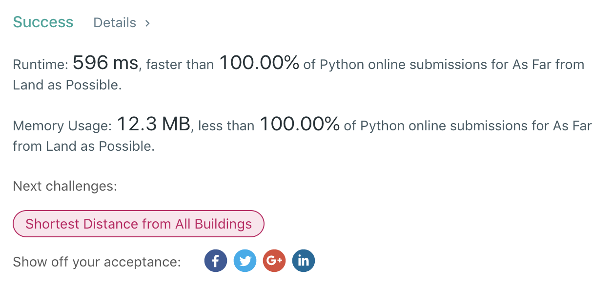

```python
class Solution(object):
    def isLand(self, x, y, grid):
        if x < 0 or y < 0:
            return False
        if x >= len(grid):
            return False
        if y >= len(grid[0]):
            return False
        if grid[x][y] == 0:
            return False
        return True

    def canReachLand(self, x, y, grid, dist):
        for dx in range(dist + 1):
            dy = dist - dx
            if self.isLand(x + dx, y + dy, grid):
                return True
            if self.isLand(x - dx, y + dy, grid):
                return True
            if self.isLand(x + dx, y - dy, grid):
                return True
            if self.isLand(x - dx, y - dy, grid):
                    return True
        return False

    def getMinDist(self, x, y, grid):
        bound = len(grid) + len(grid[0])
        for dist in range(bound):
            if self.canReachLand(x, y, grid, dist):
                return dist
        return -1

    def maxDistance(self, grid):
        """
        :type grid: List[List[int]]
        :rtype: int
        """
        max_dist = -1
        for x in range(len(grid)):
            for y in range(len(grid[0])):
                if not self.isLand(x, y, grid):
                    min_dist = self.getMinDist(x, y, grid)
                    max_dist = max(max_dist, min_dist)
        return max_dist

```

```python
class Solution(object):
    def maxDistance(self, grid):
        """
        :type grid: List[List[int]]
        :rtype: int
        """
        x_range = len(grid)
        y_range = len(grid[0])
        dp_dist_mat = [[-1 for y in range(y_range)] for x in range(x_range)]
        direction = [(0, 1), (0, -1), (1, 0), (-1, 0)]
        explore_queue = []
        for x in range(x_range):
            for y in range(y_range):
                if grid[x][y] == 1:
                    dp_dist_mat[x][y] = 0
                    explore_queue.append((x, y))
        while explore_queue:
            x, y = explore_queue[0]
            del explore_queue[0]
            for dx, dy in direction:
                nx = x + dx
                ny = y + dy
                if nx >= 0 and nx < x_range and ny >= 0 and ny < y_range and dp_dist_mat[nx][ny] < 0:
                    dp_dist_mat[nx][ny] = dp_dist_mat[x][y] + 1
                    explore_queue.append((nx, ny))
        max_dist = max([max(dist_list) for dist_list in dp_dist_mat])
        return max_dist if max_dist else -1
```

