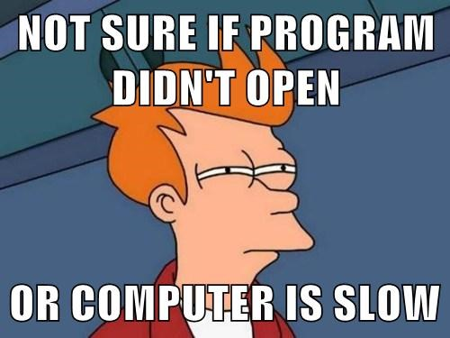
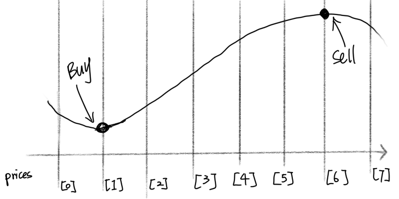

## Question in Human Language

This question asks you to pick two numbers from a list where the one on the left should be as much smaller than the one on the right as possible.

For **INHUMAN** description, please check it out on [LeetCode](https://leetcode.com/problems/best-time-to-buy-and-sell-stock/)

## Thought No. 1

Simply put, I want find the minimum in a range, and find a maximum in a range.
We then realize that find the maximum or minimum in a range is easy, but which range should we use?
Hmmm... How about every possible range? Right, we can use a `for loop` to cut the prices list
in evert possible ways.

### Implementations

The steps are:
1. Iterate the indices of the prices
    1. Split the prices into two lists (left and right of the current index)
    2. Find the minimum of the left list
    3. Find the maximum of the right list
    4. Calculate the difference between the two as the profit
    5. Update the global maximum profit
2. Return the global maximum profit if it is possible, otherwise, return zero

#### Python Ver. 1

```python
class Solution(object):
    def maxProfit(self, prices):
        """
        :type prices: List[int]
        :rtype: int
        """
        max_profit = 0
        for i in range(1, len(prices)):
            max_profit = max(max_profit, max(prices[i:]) - min(prices[:i]))
        return max_profit
```

### Review

As you have probably noticed, this solution results in a `Time Limit Exceeded`. Why is that?
Well, although it may look like a `O(n)` complexity, it is actually a `O(n^2)` because both
`max` and `min` are of `O(n)` complexity (how can you know the maximum or minimum if you haven't
look though the entire list?). Can we do better?



## Thought No. 2

What if YOLO, You Only Look (through the list) Once? If so, you need to remember the maximum
and minimum **in order** where **in order** is very tricky. We can go **backwards** through prices
assuming that we always buy at current time and sell at the seen maximum and keep track of the
global maximum profit.

### Implementations



Let's assume that we are going backwards through the prices, and use a variable to keep track of the
maximum potential selling price we have seen so far, another variable to keep track of the maximum
profit we have seen so far.

| Current index in prices | maximum potentail selling price | max profit     |
| ----------------------- | ------------------------------- | -------------- |
| Not started             | 0 (initialize)                  | 0 (initialize) |

The steps are:
1. Iterate backwards through prices
    1. Set maximum seen prices as potential selling price
    2. Calculate the profit based on seen maximum and current price
    3. Update the global maximum profit
2. Return the global maximum profit


> We iterate backwards because it's hard in Python3 to initialize a minimum value.
> You can find why that is [here](https://stackoverflow.com/questions/7604966/maximum-and-minimum-values-for-ints)

#### Python Ver. 1

```python
class Solution(object):
    def maxProfit(self, prices):
        """
        :type prices: List[int]
        :rtype: int
        """
        current_max = 0
        max_profit = 0
        """
        step 1: iterate backwards through prices
        """
        for p in prices[::-1]:
            """
            step 1.1: update seen maximum price
            """
            current_max = max(current_max, p)
            """
            step 1.2: calculate current profit
            step 1.3: update global maximum profit
            """
            max_profit = max(current_max - p, max_profit)
        """
        step 2: return global maximum profit
        """
        return max_profit
```

### Review

Hooray! Accepted! Well done!

