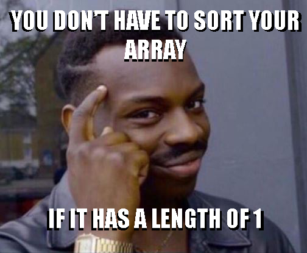

## Question in Human Language

This question asks you to reverse a list **without creating a new list**.

For **INHUMAN** description, please check it out on [LeetCode](https://leetcode.com/problems/reverse-string/)

```python
class Solution(object):
    def reverseString(self, s):
        """
        :type s: List[str]
        :rtype: None Do not return anything, modify s in-place instead.
        """
        left = 0
        right = len(s) - 1
        while left < right:
            tmp = s[left]
            s[left] = s[right]
            s[right] = tmp
            left += 1
            right -= 1
```

## Bonus

